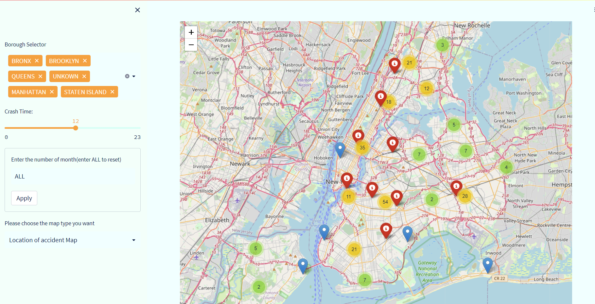

# Streamlit-Traffic accident analysis in New York City, January-August 2020
A demo application to visualize the NYC traffic accident information using Streamlit in Python.

The app provides a breakdown of the number of crashes in New York City by time of day and neighborhood, along with a brief analysis of why they happen.

The demo application allows the user to interactively filter the data based on time, month, and borough. The heatmaps for the borough and time can also be plotted.
The app also provides interactive maps and heat maps of the accident locations.

### Installation
Install the dependencies

``pip install -r requirements.txt``

### Instructions for Running 

1. The vpn service is required; otherwise, the map information may not be loaded.

2. Run the streamlit app using

    `` streamlit run NYC-accident.py``

    The application will run on localhost:8501 by default.

5. You can also use it directly online by visiting the [Link](https://docs.streamlit.io/en/latest/streamlit_configuration.html#view-all-config-options). 

### Screenshots

